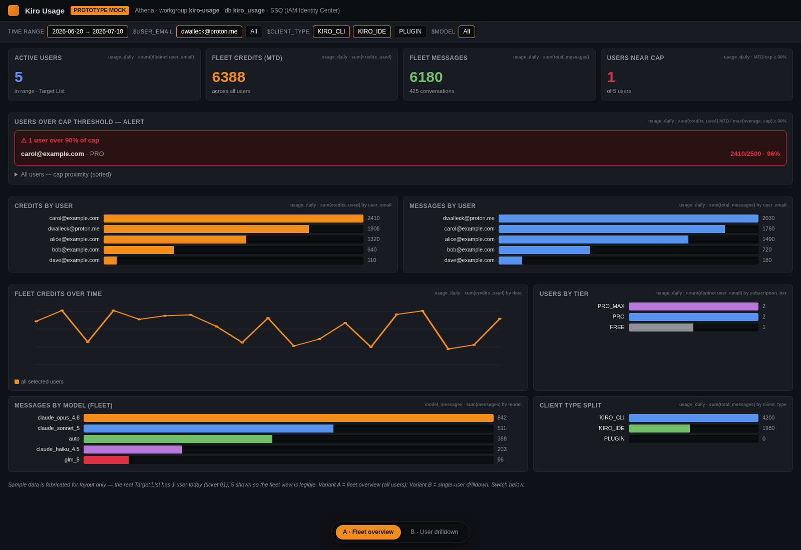
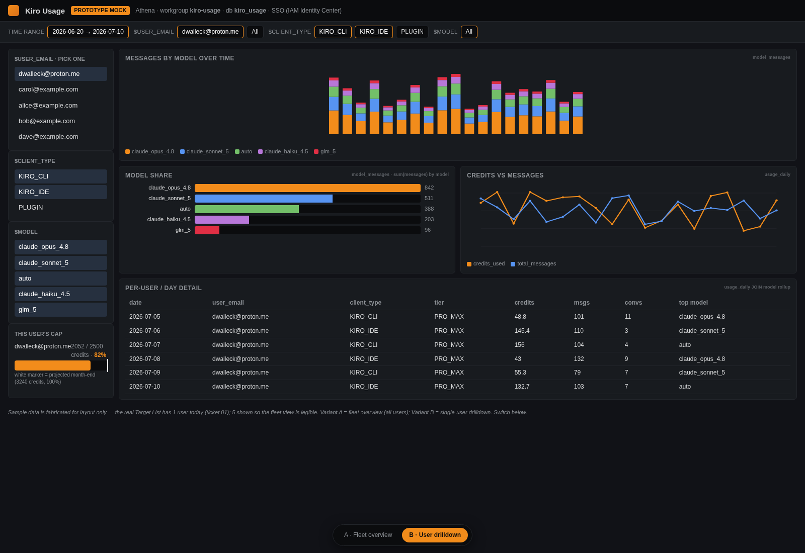
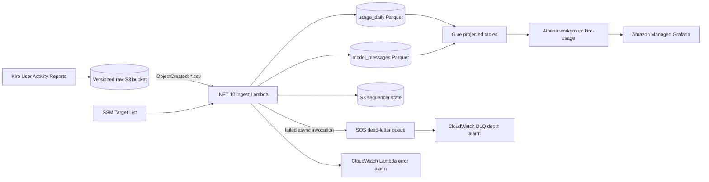

# Kiro Usage Pipeline

A serverless AWS pipeline and dashboard for analyzing Kiro usage by a controlled set of users.

Kiro delivers daily **User Activity Report** CSVs to S3. This project filters those reports
against an explicit **Target List** of user emails, transforms the wide model columns into stable
analytics facts, writes Snappy Parquet, and serves the data through Athena and Amazon Managed
Grafana.

> [!NOTE]
> This repository is a single-account proof of concept. Its defaults target account
> `369434902231`, region `us-east-1`, and AWS CLI profile
> `AdministratorAccess-369434902231`. The infrastructure itself derives bucket names and IAM
> scope from the deployment account and region, while the helper script defaults can be
> overridden with environment variables.

## Dashboard preview

The repository includes two importable Grafana dashboards. The images below are conceptual
prototype mockups with fabricated values—not captures of the deployed workspace—so individual
panel placement may differ from the current JSON. Deployed dashboards query live Athena data.

### Fleet overview

Fleet KPIs, users near their cap, per-user comparisons, trends, model distribution, and client
split.



### User drilldown

Model usage over time, model share, credits versus messages, cap status, and per-day details for
one Target User.



Dashboard JSON:

- [Fleet Overview](.scratch/kiro-usage-dashboard/dashboards/a-fleet-overview.json)
- [User Drilldown](.scratch/kiro-usage-dashboard/dashboards/b-user-drilldown.json)

## What it does

1. Kiro writes User Activity Report CSVs to a versioned raw S3 bucket.
2. An S3 `ObjectCreated` notification invokes a .NET 10 Lambda.
3. The Lambda reads the current SSM Parameter Store Target List and fails closed: users not on
   the list are never emitted.
4. It validates the fixed report schema and typed values, then produces:
   - `usage_daily`: one Daily Usage Fact per date, User Id, and client type.
   - `model_messages`: dynamic `<model>_messages` columns Unpivoted into one Model Message Fact
     per date, User Id, client type, and model.
5. Both facts are serialized as Snappy Parquet and partitioned by date and client type.
6. Glue tables use partition projection, so there is no crawler or runtime partition
   registration.
7. Athena exposes the facts to Amazon Managed Grafana.
8. Lambda failures retry asynchronously and land in an SQS dead-letter queue after retry
   exhaustion.

The transform is deliberately strict. Missing required columns, malformed CSV, duplicate fact
keys, unsupported client types, non-finite numbers, and negative usage counts fail the object
rather than creating misleading analytics data.

## Architecture



Everything runs in one AWS account and one region. The raw, analytics, Lambda, Glue, Athena, and
Grafana resources are co-located in `us-east-1` by default.

## Data layout

```text
s3://<raw-bucket>/AWSLogs/<account>/KiroLogs/user_report/<region>/<yyyy>/<mm>/<dd>/00/*.csv

s3://<analytics-bucket>/usage_daily/date=YYYY-MM-DD/client_type=KIRO_CLI/*.parquet
s3://<analytics-bucket>/model_messages/date=YYYY-MM-DD/client_type=KIRO_CLI/*.parquet
s3://<analytics-bucket>/ingest-state/*.json
s3://<analytics-bucket>/athena-results/*
```

Output filenames combine the source CSV basename with a short SHA-256 hash of its complete
bucket/key identity. Reprocessing reconciles obsolete output files, and S3 version IDs plus event
sequencers prevent older overwrite events from replacing newer facts.

## AWS resources

The CDK stack creates:

- Versioned, Kiro-writable raw S3 bucket
- Analytics S3 bucket with 14-day expiry for `athena-results/`
- SSM `StringList` Target List at `/kiro-usage/target-list`
- .NET 10 ingest Lambda with reserved concurrency of one
- S3 event notification for `user_report/**/*.csv`
- SQS dead-letter queue
- CloudWatch Lambda-error and DLQ-depth alarms
- Glue database `kiro_usage`
- Projected Glue tables `usage_daily` and `model_messages`
- Athena workgroup `kiro-usage` with an enforced output location and 1 GiB scan cap
- Amazon Managed Grafana workspace with IAM Identity Center authentication
- Scoped Grafana IAM role for Athena, Glue, and analytics S3 access

Buckets and an optional KMS key use `RETAIN`, so destroying the stack does not automatically
delete retained data.

## Prerequisites

Install or configure:

- AWS account with permissions to deploy the resources above
- AWS CLI v2 and an authenticated profile
- Node.js/npm for the AWS CDK CLI (`npx cdk`)
- .NET 8 SDK for `KiroInfra`
- .NET 10 SDK for `KiroIngest` and its tests
- Docker, used by CDK to publish the .NET 10 Lambda asset
- `jq`, used by `scripts/backfill.sh`
- IAM Identity Center enabled in the AWS account
- A bootstrapped CDK environment in the target account and region

The examples below use:

```bash
export AWS_PROFILE=AdministratorAccess-369434902231
export AWS_REGION=us-east-1
```

Authenticate and verify the target account:

```bash
aws sso login --profile "$AWS_PROFILE"
aws sts get-caller-identity --profile "$AWS_PROFILE"
```

Bootstrap CDK once per account/region:

```bash
npx cdk bootstrap aws://369434902231/us-east-1 \
  --profile "$AWS_PROFILE"
```

## Setup

### 1. Clone, restore, and build

```bash
git clone https://github.com/dwalleck/kiro-usage-pipeline.git
cd kiro-usage-pipeline

dotnet restore src/KiroInfra.sln
dotnet restore test/KiroIngest.Tests/KiroIngest.Tests.csproj
dotnet build src/KiroInfra.sln
dotnet build src/KiroIngest/KiroIngest.csproj
```

### 2. Review the deployment

Docker must be running because CDK bundles the Lambda with the .NET 10 SDK image.

```bash
npx cdk synth KiroInfraStack --profile "$AWS_PROFILE" --strict
npx cdk diff KiroInfraStack --profile "$AWS_PROFILE" --strict
```

The default is SSE-S3 encryption. To synthesize or deploy with a customer-managed KMS key:

```bash
npx cdk synth KiroInfraStack --profile "$AWS_PROFILE" --strict -c UseCustomKey=true
```

### 3. Deploy

```bash
npx cdk deploy KiroInfraStack --profile "$AWS_PROFILE" --strict
```

Important stack outputs include:

| Output | Purpose |
| --- | --- |
| `RawBucketUri` | S3 destination to configure in Kiro |
| `AnalyticsBucketName` | Curated Parquet and Athena results bucket |
| `TargetListParameterName` | SSM Target List parameter |
| `IngestLambdaName` | Lambda name used by operational commands |
| `IngestDlqUrl` | Failed-event queue URL |
| `IngestErrorAlarmName` | Lambda error alarm |
| `IngestDlqAlarmName` | DLQ depth alarm |
| `GlueDatabaseName` | `kiro_usage` |
| `AthenaWorkGroupName` | `kiro-usage` |
| `GrafanaWorkspaceUrl` | Workspace sign-in URL |
| `GrafanaDataSourceRoleArn` | Scoped workspace data-source role |

To print all outputs later:

```bash
aws cloudformation describe-stacks \
  --stack-name KiroInfraStack \
  --profile "$AWS_PROFILE" \
  --region "$AWS_REGION" \
  --query 'Stacks[0].Outputs' \
  --output table
```

### 4. Point Kiro at the raw bucket

In the Kiro console, open **Settings → User activity report** and configure the S3 location from
the `RawBucketUri` stack output. Use the bucket root; Kiro creates the `AWSLogs/.../user_report/`
path below it.

If `UseCustomKey=true`, also configure the `EncryptionKeyArn` output in Kiro's encryption-key
setting.

### 5. Configure the Target List

The stack seeds the POC Target List with `dwalleck@proton.me`. Replace it with the User Emails
you are authorized to retain:

```bash
aws ssm put-parameter \
  --name /kiro-usage/target-list \
  --type StringList \
  --value 'alice@example.com,bob@example.com' \
  --overwrite \
  --profile "$AWS_PROFILE" \
  --region "$AWS_REGION"
```

The Lambda reads the parameter for each source object, so additions and removals do not require a
redeploy. Re-run a bounded or full backfill after changing the Target List to reconcile historical
facts.

### 6. Load historical reports

Reports must already be under the new raw bucket's `user_report/` prefix. Start a full or bounded
backfill:

```bash
# Full history
./scripts/backfill.sh

# Bounded history
./scripts/backfill.sh --from 2026-06-20 --to 2026-07-10
```

The script defaults can be overridden:

```bash
AWS_PROFILE=my-profile \
AWS_REGION=us-east-1 \
STACK_NAME=KiroInfraStack \
./scripts/backfill.sh --from 2026-07-01
```

Backfill invocation is asynchronous. Each invocation handles one S3 listing page, schedules the
next page when necessary, and continues past individual bad objects before reporting an aggregate
failure. Monitor CloudWatch and the DLQ for completion or errors.

### 7. Assign a Grafana administrator

The workspace uses IAM Identity Center. After deployment:

1. Open **Amazon Managed Grafana → Kiro-Usage**.
2. Assign an IAM Identity Center user or group to the workspace.
3. Give the initial operator the **Admin** workspace role.
4. Open `GrafanaWorkspaceUrl` and sign in.

### 8. Configure Athena in Grafana

In Grafana, open **Connections → Data sources → Add data source → Athena** and set:

| Setting | Value |
| --- | --- |
| Name | `Athena` |
| Authentication provider | Workspace IAM role |
| Default region | `us-east-1` |
| Catalog | `AwsDataCatalog` |
| Database | `kiro_usage` |
| Workgroup | `kiro-usage` |
| Output location | `s3://<AnalyticsBucketName>/athena-results/` |

Select **Save & test** and confirm the connection succeeds.

### 9. Import the dashboards

1. Create a Grafana folder named **Kiro Usage**.
2. Open **Dashboards → New → Import**.
3. Import:
   - `.scratch/kiro-usage-dashboard/dashboards/a-fleet-overview.json`
   - `.scratch/kiro-usage-dashboard/dashboards/b-user-drilldown.json`
4. Select the `Athena` data source and save each dashboard in the **Kiro Usage** folder.

The dashboards expose shared `$user_email`, `$client_type`, and `$model` variables. Date filters
are applied to partition keys so Athena can prune scans.

## Temporary Grafana integration spike

This workflow proves automated workspace-role assignment, Athena data-source configuration, and
dashboard reconciliation against a separate workspace named `Kiro-Usage-Integration-Spike`. It
does not modify the production-named `Kiro-Usage` workspace in `KiroInfraStack`.

> [!WARNING]
> The commands in this section create AWS resources and incur Amazon Managed Grafana charges.
> They require explicit deployment approval. They are not part of a code-only validation run.
> After deployment, leave the temporary workspace in place for review until cleanup receives
> separate explicit approval.

Both `us-east-1` and the IAM Identity Center home Region, `us-east-2`, must be CDK-bootstrapped.
Use the existing IAM Identity Center instance and identity store `d-9a673a2cf5`.

### 1. Deploy the retained Identity Center groups

```bash
npx cdk deploy KiroIdentityFoundationStack \
  --profile "$AWS_PROFILE" \
  --region us-east-2 \
  --strict
```

The stack creates and retains three groups. It never manages individual memberships. Read their
IDs from the stack outputs:

```bash
ADMIN_GROUP_ID=$(aws cloudformation describe-stacks \
  --stack-name KiroIdentityFoundationStack \
  --profile "$AWS_PROFILE" \
  --region us-east-2 \
  --query "Stacks[0].Outputs[?OutputKey=='GrafanaAdminGroupId'].OutputValue | [0]" \
  --output text)

EDITOR_GROUP_ID=$(aws cloudformation describe-stacks \
  --stack-name KiroIdentityFoundationStack \
  --profile "$AWS_PROFILE" \
  --region us-east-2 \
  --query "Stacks[0].Outputs[?OutputKey=='GrafanaEditorGroupId'].OutputValue | [0]" \
  --output text)

VIEWER_GROUP_ID=$(aws cloudformation describe-stacks \
  --stack-name KiroIdentityFoundationStack \
  --profile "$AWS_PROFILE" \
  --region us-east-2 \
  --query "Stacks[0].Outputs[?OutputKey=='GrafanaViewerGroupId'].OutputValue | [0]" \
  --output text)
```

In IAM Identity Center, manually:

1. Add the primary operator to `kiro-usage-grafana-admins`.
2. Add the demo person to `kiro-usage-grafana-viewers`.
3. Leave `kiro-usage-grafana-editors` empty unless exploratory UI editing is intentional.

### 2. Deploy the isolated spike workspace

Read the existing data-plane bucket from `KiroInfraStack`, then pass it and the group outputs to
the temporary stack:

```bash
ANALYTICS_BUCKET=$(aws cloudformation describe-stacks \
  --stack-name KiroInfraStack \
  --profile "$AWS_PROFILE" \
  --region us-east-1 \
  --query "Stacks[0].Outputs[?OutputKey=='AnalyticsBucketName'].OutputValue | [0]" \
  --output text)

npx cdk deploy KiroGrafanaIntegrationSpikeStack \
  --profile "$AWS_PROFILE" \
  --region us-east-1 \
  --strict \
  --parameters AnalyticsBucketName="$ANALYTICS_BUCKET" \
  --parameters GrafanaAdminGroupId="$ADMIN_GROUP_ID" \
  --parameters GrafanaEditorGroupId="$EDITOR_GROUP_ID" \
  --parameters GrafanaViewerGroupId="$VIEWER_GROUP_ID"
```

The custom-resource provider assigns workspace roles, creates the `Kiro Usage` folder, configures
the `kiro-athena` data source, verifies its health, and reconciles both committed dashboards. Its
Admin service-account token lives for at most 15 minutes and is deleted with the service account
before the CloudFormation operation completes.

### 3. Conduct the manual review

1. As an Admin, verify the stack output URL, Athena health, both dashboards, and live values.
2. As the demo Viewer, verify both dashboards render and that dashboard editing and
   Explore/ad hoc Athena querying are unavailable. Stop and record the access-control limitation
   if the standard Viewer role permits either action.
3. As an Admin, make a harmless dashboard edit, deploy the spike stack again with the same
   parameters, and verify the committed JSON restores the dashboard without duplication.
4. Verify through the workspace and CloudWatch logs that no provisioning service account or token
   remains.

Dashboard JSON in this repository is authoritative: every spike deployment overwrites UI drift.

### Cleanup requires separate approval

Do not destroy either spike stack as part of deployment or review. Keep the workspace available
for reviewers. Only begin cleanup after explicit approval; the Identity Center groups use
`Retain`, so their later removal is a separate deliberate action.

## Operations

### Update the Target List

Use `aws ssm put-parameter` as shown above, then backfill the affected date range. Removing a user
is fail-closed: reprocessing deletes obsolete fact files for that source.

### Watch Lambda logs

```bash
FUNCTION_NAME=$(aws cloudformation describe-stacks \
  --stack-name KiroInfraStack \
  --profile "$AWS_PROFILE" \
  --region "$AWS_REGION" \
  --query "Stacks[0].Outputs[?OutputKey=='IngestLambdaName'].OutputValue" \
  --output text)

aws logs tail "/aws/lambda/$FUNCTION_NAME" \
  --follow \
  --profile "$AWS_PROFILE" \
  --region "$AWS_REGION"
```

Structured events include `ingest_complete`, `ingest_error`, `invocation_error`,
`ingest_skipped_stale`, and backfill page lifecycle events.

### Inspect the DLQ

```bash
DLQ_URL=$(aws cloudformation describe-stacks \
  --stack-name KiroInfraStack \
  --profile "$AWS_PROFILE" \
  --region "$AWS_REGION" \
  --query "Stacks[0].Outputs[?OutputKey=='IngestDlqUrl'].OutputValue" \
  --output text)

aws sqs receive-message \
  --queue-url "$DLQ_URL" \
  --max-number-of-messages 10 \
  --profile "$AWS_PROFILE" \
  --region "$AWS_REGION"
```

The stack creates CloudWatch alarms but does not attach notification actions. Add an SNS or other
alarm action if operators need email, chat, or paging notifications.

### Query the facts directly

Use the `kiro-usage` Athena workgroup and `kiro_usage` database. Always filter on `date` and,
where possible, `client_type` for partition pruning:

```sql
SELECT date, client_type, user_email, credits_used, total_messages
FROM kiro_usage.usage_daily
WHERE date BETWEEN DATE '2026-07-01' AND DATE '2026-07-10'
  AND client_type IN ('KIRO_CLI', 'KIRO_IDE')
ORDER BY date, user_email;
```

## Development

### Project layout

```text
src/KiroInfra/          C# CDK stack and constructs (.NET 8)
src/KiroIngest/         Event handler, validation, transform, and Parquet writer (.NET 10)
test/KiroIngest.Tests/  TUnit test executable (.NET 10)
scripts/backfill.sh     Asynchronous historical backfill helper
.scratch/kiro-usage-dashboard/
  dashboards/           Importable Grafana dashboard JSON
  assets/               Research findings and dashboard prototype
docs/images/            README dashboard screenshots
CONTEXT.md               Domain glossary
```

### Build

```bash
dotnet build src/KiroInfra.sln
dotnet build src/KiroIngest/KiroIngest.csproj
```

### Test

The tests use TUnit on Microsoft.Testing.Platform. Run them with `dotnet run`, not `dotnet test`:

```bash
dotnet run --project test/KiroIngest.Tests/KiroIngest.Tests.csproj
```

To pass Microsoft Testing Platform arguments, put them after `--`.

### Synthesize and diff infrastructure

```bash
npx cdk synth --profile "$AWS_PROFILE" --strict
npx cdk diff --profile "$AWS_PROFILE" --strict
```

Docker is required because synthesis bundles the Lambda with
`mcr.microsoft.com/dotnet/sdk:10.0`.

### Work on the dashboards

- Edit the importable JSON under `.scratch/kiro-usage-dashboard/dashboards/`.
- Open the static mock locally:

  ```bash
  chromium '.scratch/kiro-usage-dashboard/assets/06-grafana-dashboard-mock.html?variant=a'
  chromium '.scratch/kiro-usage-dashboard/assets/06-grafana-dashboard-mock.html?variant=b'
  ```

- Regenerate README screenshots:

  ```bash
  mkdir -p docs/images
  MOCK="file://$(pwd)/.scratch/kiro-usage-dashboard/assets/06-grafana-dashboard-mock.html"
  chromium --headless --disable-gpu --no-sandbox --hide-scrollbars \
    --window-size=1600,1100 \
    --screenshot=docs/images/dashboard-fleet-overview.png \
    "${MOCK}?variant=a"
  chromium --headless --disable-gpu --no-sandbox --hide-scrollbars \
    --window-size=1600,1100 \
    --screenshot=docs/images/dashboard-user-drilldown.png \
    "${MOCK}?variant=b"
  ```

### Development rules worth knowing

- Use the terms in `CONTEXT.md` consistently: User Activity Report, Target List, Target User,
  Daily Usage Fact, Model Message Fact, and Unpivot.
- Keep `date` and `client_type` as path-only partition keys; they are not Parquet body columns.
- Keep output filenames deterministic and source-identity-derived.
- New model columns become rows in `model_messages`, not schema changes.
- Do not use `dotnet test`; the test project runs on Microsoft.Testing.Platform.
- Run the full test suite and `cdk synth` before deployment.

## Design documentation

- [POC specification](.scratch/kiro-usage-dashboard/spec.md)
- [Wayfinder map and decisions](.scratch/kiro-usage-dashboard/map.md)
- [Dashboard import guide](.scratch/kiro-usage-dashboard/dashboards/README.md)
- [Domain glossary](CONTEXT.md)
